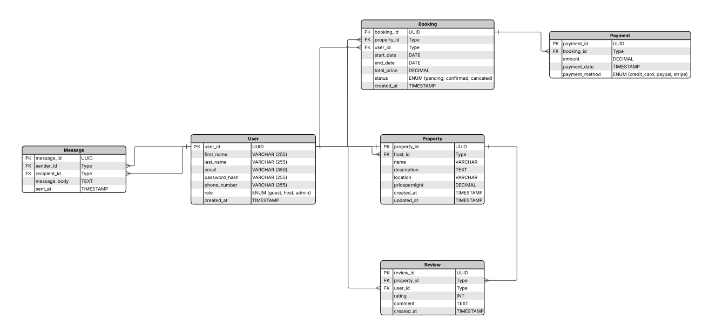

# 🏡 Airbnb Clone – Entity Relationship Diagram (ERD)

## 🧩 1. Entities and Attributes

### **User**
| Field | Type | Constraints |
|--------|------|-------------|
| `user_id` | UUID | **Primary Key**, Indexed |
| `first_name` | VARCHAR | NOT NULL |
| `last_name` | VARCHAR | NOT NULL |
| `email` | VARCHAR | UNIQUE, NOT NULL |
| `password_hash` | VARCHAR | NOT NULL |
| `phone_number` | VARCHAR | NULL |
| `role` | ENUM('guest', 'host', 'admin') | NOT NULL |
| `created_at` | TIMESTAMP | DEFAULT CURRENT_TIMESTAMP |

---

### **Property**
| Field | Type | Constraints |
|--------|------|-------------|
| `property_id` | UUID | **Primary Key**, Indexed |
| `host_id` | UUID | **Foreign Key** → `User(user_id)` |
| `name` | VARCHAR | NOT NULL |
| `description` | TEXT | NOT NULL |
| `location` | VARCHAR | NOT NULL |
| `price_per_night` | DECIMAL | NOT NULL |
| `created_at` | TIMESTAMP | DEFAULT CURRENT_TIMESTAMP |
| `updated_at` | TIMESTAMP | ON UPDATE CURRENT_TIMESTAMP |

---

### **Booking**
| Field | Type | Constraints |
|--------|------|-------------|
| `booking_id` | UUID | **Primary Key**, Indexed |
| `property_id` | UUID | **Foreign Key** → `Property(property_id)` |
| `user_id` | UUID | **Foreign Key** → `User(user_id)` |
| `start_date` | DATE | NOT NULL |
| `end_date` | DATE | NOT NULL |
| `total_price` | DECIMAL | NOT NULL |
| `status` | ENUM('pending', 'confirmed', 'canceled') | NOT NULL |
| `created_at` | TIMESTAMP | DEFAULT CURRENT_TIMESTAMP |

---

### **Payment**
| Field | Type | Constraints |
|--------|------|-------------|
| `payment_id` | UUID | **Primary Key**, Indexed |
| `booking_id` | UUID | **Foreign Key** → `Booking(booking_id)` *(nullable for pending bookings)* |
| `amount` | DECIMAL | NOT NULL |
| `payment_date` | TIMESTAMP | DEFAULT CURRENT_TIMESTAMP |
| `payment_method` | ENUM('credit_card', 'paypal', 'stripe') | NOT NULL |

---

### **Review**
| Field | Type | Constraints |
|--------|------|-------------|
| `review_id` | UUID | **Primary Key**, Indexed |
| `property_id` | UUID | **Foreign Key** → `Property(property_id)` |
| `user_id` | UUID | **Foreign Key** → `User(user_id)` |
| `rating` | INTEGER | CHECK (rating BETWEEN 1 AND 5), NOT NULL |
| `comment` | TEXT | NOT NULL |
| `created_at` | TIMESTAMP | DEFAULT CURRENT_TIMESTAMP |

---

### **Message**
| Field | Type | Constraints |
|--------|------|-------------|
| `message_id` | UUID | **Primary Key**, Indexed |
| `sender_id` | UUID | **Foreign Key** → `User(user_id)` |
| `recipient_id` | UUID | **Foreign Key** → `User(user_id)` |
| `message_body` | TEXT | NOT NULL |
| `sent_at` | TIMESTAMP | DEFAULT CURRENT_TIMESTAMP |

---

## 🔗 2. Relationships Between Entities

| Relationship | Cardinality | Description |
|---------------|--------------|--------------|
| **User → Property** | 1 → Many | A host can list multiple properties. |
| **User → Booking** | 1 → Many | A guest can make multiple bookings. |
| **Property → Booking** | 1 → Many | A property can have multiple bookings. |
| **Booking → Payment** | 1 → 1 *(optional)* | Each booking may have one payment record. |
| **User → Review** | 1 → Many | A user can write multiple reviews. |
| **Property → Review** | 1 → Many | A property can have multiple reviews. |
| **User → Message (sender_id)** | 1 → Many | A user can send multiple messages. |
| **User → Message (recipient_id)** | 1 → Many | A user can receive multiple messages. |

---

## 📊 3. ER Diagram (Conceptual Overview)
